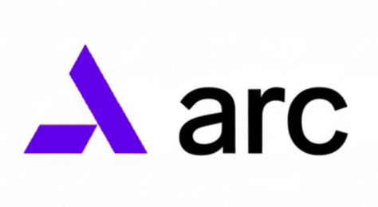

<h1 align="center">
  
</h1>

<h4 align="center">Systems Programming Language<br>High Performance, Native Code, Modern Syntax</h4>

<p align="center">
    
    
    
</p>

---

## What is Arc?

Arc is a modern systems programming language for building native applications, servers, CLI tools, and kernel drivers with C-level performance.

Arc provides manual memory management, zero-cost abstractions, and seamless C/C++/Objective-C interoperability. The language compiles to efficient native code for x86-64, ARM64, and other CPU architectures.

**Hardware acceleration built-in:** When you need it, Arc functions can also compile to GPUs and TPUs without leaving your codebase or learning new APIs.

---

## Language Overview

### Type System

```arc
// Fixed-width integers
let i: int32 = -500
let u: uint64 = 10000

// Pointer-sized integers
let size: usize = 100      // Unsigned (array indexing, sizes)
let offset: isize = -4     // Signed (offsets)

// Floating point
let f: float32 = 3.14
let d: float64 = 2.71828

// Pointers and references
let ptr: *int32 = &value
let ref: &int32 = value

// Structs (value types)
struct Point {
    x: int32
    y: int32
}

// Classes (reference types)
class Client {
    name: string
    port: int32
}
```

### Memory Management

Arc uses manual memory management with explicit allocation and deallocation:

```arc
// Stack allocation
let buffer = alloca<byte>(4096)
memset(buffer, 0, 4096)

// Heap allocation (via FFI)
extern c {
    func malloc(usize) *void
    func free(*void) void
}

let ptr = malloc(1024)
defer free(ptr)  // Cleanup on scope exit

// Direct pointer manipulation
let next = ptr + 1
let value = *ptr
*ptr = 42
```

### Foreign Function Interface

Direct interop with C, C++, and Objective-C:

```arc
// C libraries
extern c {
    func printf(*byte, ...) int32
    func sqlite3_open(*byte, **sqlite3) int32
}

// C++ libraries
extern cpp {
    namespace DirectX {
        class ID3D11Device {
            virtual func CreateBuffer(
                self *ID3D11Device,
                *D3D11_BUFFER_DESC,
                **ID3D11Buffer
            ) HRESULT
        }
    }
}

// Objective-C frameworks
extern objc {
    class NSWindow {
        new "initWithContentRect:styleMask:backing:defer:" (
            NSRect, uint64, uint64, bool
        ) *NSWindow
    }
}
```

### Async/Await

```arc
async func fetch_data(url: string) string {
    let response = await http.get(url)
    return response.body
}

async func main() {
    let data = await fetch_data("https://api.example.com")
    io.print(data)
}
```

### Generics

Monomorphized at compile time:

```arc
func swap<T>(a: *T, b: *T) {
    let tmp: T = *a
    *a = *b
    *b = tmp
}

struct Box<T> {
    value: T
    
    func get(self b: Box<T>) T {
        return b.value
    }
}
```

---

## Example Programs

### HTTP Server

```arc
namespace main

import "net"
import "io"

async func handle_request(conn: *net.TcpStream) {
    let buffer: array<byte, 4096> = {}
    let bytes_read = await conn.read(&buffer)
    
    let response = "HTTP/1.1 200 OK\r\nContent-Length: 2\r\n\r\nOK"
    await conn.write(response.as_bytes())
}

async func main() {
    let listener = net.TcpListener.bind("0.0.0.0:8080")
    io.print("Server listening on port 8080")
    
    for {
        let (conn, addr) = await listener.accept()
        spawn handle_request(conn)
    }
}
```

### Database Application

```arc
namespace main

extern c {
    opaque struct sqlite3 {}
    opaque struct sqlite3_stmt {}
    
    const SQLITE_OK: int32 = 0
    const SQLITE_ROW: int32 = 100
    
    func sqlite3_open(*byte, **sqlite3) int32
    func sqlite3_close(*sqlite3) int32
    func sqlite3_prepare_v2(*sqlite3, *byte, int32, **sqlite3_stmt, **byte) int32
    func sqlite3_step(*sqlite3_stmt) int32
    func sqlite3_column_text(*sqlite3_stmt, int32) *byte
    func printf(*byte, ...) int32
}

func main() {
    let db: *sqlite3 = null
    
    if sqlite3_open("app.db", &db) != SQLITE_OK {
        printf("Failed to open database\n")
        return
    }
    defer sqlite3_close(db)
    
    let stmt: *sqlite3_stmt = null
    sqlite3_prepare_v2(db, "SELECT name FROM users", -1, &stmt, null)
    
    for sqlite3_step(stmt) == SQLITE_ROW {
        let name = sqlite3_column_text(stmt, 0)
        printf("User: %s\n", name)
    }
}
```

### Native GUI Application

```arc
namespace main

import objc "AppKit"

class AppDelegate: NSApplicationDelegate {
    window: *NSWindow
    
    func applicationDidFinishLaunching(self d: *AppDelegate, notif: *NSNotification) {
        let rect = NSMakeRect(0, 0, 800, 600)
        let style = NSWindowStyleMaskTitled | NSWindowStyleMaskClosable
        
        d.window = NSWindow.new(rect, style, NSBackingStoreBuffered, false)
        d.window.title = NSString.from("Arc Application")
        d.window.center()
        d.window.makeKeyAndOrderFront(null)
    }
}

func main() {
    let app = NSApplication.sharedApplication()
    let delegate = AppDelegate{}
    app.delegate = &delegate
    app.run()
}
```

### Kernel Module

```arc
namespace driver

import "linux/kernel/driver"
import "linux/kernel/log"

func init_module() int32 {
    log.info("Driver loading")
    
    let dev = driver.CharDevice.new("custom_device", 0)
    
    dev.on_read(func(file: *driver.File, buffer: *byte, size: uint64) int64 {
        let data = "Hello from kernel"
        memcpy(buffer, data.as_bytes(), data.len())
        return cast<int64>(data.len())
    })
    
    return 0
}

func cleanup_module() {
    log.info("Driver unloading")
}
```

### AI Model Inference

```arc
namespace main

import "ai"
import "io"

func main() {
    // Load model
    let model = ai.load_model("models/model-7b.gguf")
    defer model.free()
    
    // Configure
    let config = ai.InferenceConfig{
        temperature: 0.7,
        top_p: 0.9,
        max_tokens: 512
    }
    
    // Generate
    let prompt = "Explain quantum computing:"
    let tokens = model.tokenize(prompt)
    
    io.printf("Generating...\n")
    
    for token in model.generate(tokens, config) {
        let text = model.decode(token)
        io.printf("%s", text)
    }
    
    io.printf("\n")
}
```

---

## Hardware Acceleration

Arc can compile functions to run on specialized hardware when you need maximum performance:

```arc
namespace compute

import "ai"

// CPU version (default)
func process_data(data: *float32, size: usize) {
    for let i: usize = 0; i < size; i++ {
        data[i] = data[i] * 2.0
    }
}

// GPU version
async func process_gpu<gpu.cuda>(data: *float32, size: usize) {
    let idx = gpu.thread_id()
    if idx < size {
        data[idx] = data[idx] * 2.0
    }
}

// TPU version
async func process_tpu<tpu>(data: Tensor) Tensor {
    return data.multiply(2.0)
}

// Train model on GPU
async func train<gpu.cuda>(model: *ai.Model, data: *Tensor) {
    for epoch in 0..100 {
        let loss = model.forward(data)
        model.backward(loss)
        model.step()
    }
}

func main() {
    let model = ai.load_model("models/model-13b.gguf")
    let data = ai.load_tensor("training_data.bin")
    
    // Train on NVIDIA GPU
    await train<gpu.cuda>(&model, &data)
    
    io.printf("Training complete\n")
}
```

---

## Package Management

Arc downloads packages via HTTPS to a local cache (`~/.arc/`). No system package managers required.

### Source Code

```arc
// main.ax
namespace main

import c "sqlite3"
import c "curl"
import "io"
import "ai"

func main() {
    // Use imported libraries
}
```

### Configuration

```go
// ax.mod
module myapp
arc 1.0

require (
    io v1.2
    ai v2.0
)

require c (
    sqlite3 v3.36 (
        debian   "debian.org/libsqlite3-dev"
        ubuntu   "ubuntu.org/libsqlite3-dev"
        macos    "brew.sh/sqlite"
        windows  "vcpkg.io/sqlite3"
        default  "vcpkg.io/sqlite3"
    )
    
    curl v7.80 (
        default  "vcpkg.io/curl"
    )
)
```

The compiler detects your platform and downloads the appropriate packages to `~/.arc/cache/`.

---

## Supported Targets

### CPU Architectures
- x86-64 (Intel, AMD)
- ARM64 (Apple Silicon, ARM servers)
- RISC-V (in progress)

### Operating Systems
- Linux (Ubuntu, Debian, Arch, Fedora, Alpine, etc.)
- macOS (Intel and Apple Silicon)
- Windows (x64)
- FreeBSD

### Accelerators
- NVIDIA GPUs (`<gpu.cuda>`)
- AMD GPUs (`<gpu.rocm>`)
- Apple Silicon (`<gpu.metal>`)
- Intel GPUs (`<gpu.oneapi>`)
- Google TPUs (`<tpu>`)
- AWS Trainium (`<aws.trainium>`)

---

## Installation

```bash
git clone https://github.com/arc-language/arc-lang
cd arc-lang/cmd
./build build
./test_runner
```

### Build a Program

```bash
./arc build main.ax -o main
./main
```

---

## Documentation

- **[Language Reference](docs/reference.md)** - Complete syntax and semantics
- **[Grammar Specification](docs/grammar_1.0.md)** - Language grammar
- **[Package Management](docs/package_manager.md)** - Dependency resolution
- **[Foreign Function Interface](docs/extern.md)** - C/C++/Objective-C interop
- **[Kernel Drivers](docs/kernel_drivers.md)** - Systems programming
- **[Compiler Intrinsics](docs/intrinsics_1.2.md)** - Built-in functions

---

## Current Status

**Beta Release**

Working:
- Core language features
- C/C++/Objective-C FFI
- Package management
- CPU compilation (x86-64, ARM64)
- GPU compilation (CUDA, Metal)
- Kernel driver support

In Development:
- Standard library
- AI model runtime
- TPU backend
- Additional GPU targets
- Tooling (LSP, debugger)

---

## License

Licensed under either of

* Apache License, Version 2.0 ([LICENSE-APACHE](LICENSE-APACHE) or http://www.apache.org/licenses/LICENSE-2.0)
* MIT license ([LICENSE-MIT](LICENSE-MIT) or http://opensource.org/licenses/MIT)

at your option.

## Contribution

Unless you explicitly state otherwise, any contribution intentionally submitted for inclusion in the work by you, as defined in the Apache-2.0 license, shall be dual licensed as above, without any additional terms or conditions.