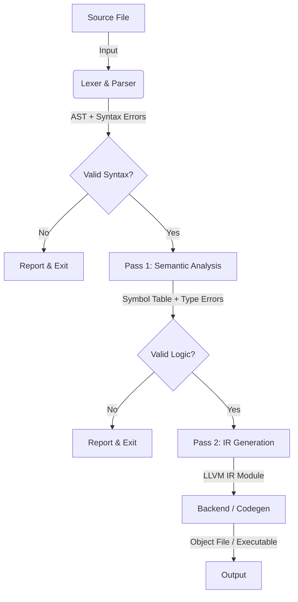

# Architecture Overview (v2.0)

This document outlines the architecture of the **Arc Language Compiler v2.0**.

The new architecture moves away from a monolithic single-pass design to a modular **Multi-Pass System**. This separation allows for robust features like forward references, type inference, and distinct error reporting stages.

## 1. High-Level Pipeline

The compilation process is a linear pipeline orchestrated by the **Driver**. If any stage fails, the process halts immediately to prevent cascading errors.



---

## 2. Project Structure

The project uses a flat, top-level package structure to map specific domains to Go packages.

```text
/
├── cmd/
│   └── arc/              # Main entry point (CLI argument parsing)
│
├── compiler/             # THE DRIVER: Orchestrates the pipeline.
│
├── diagnostic/           # ERROR SYSTEM: Shared error reporting bag.
│
├── symbol/               # THE GLUE: Shared data structures (Scopes, Symbols).
│                         # Imported by both Semantics and IRGen.
│
├── semantics/            # PASS 1 (The Brain): Logic validation & Type checking.
│
├── irgen/                # PASS 2 (The Builder): Mechanical AST -> IR translation.
│
├── builder/              # LLVM IR construction logic.
│
└── codegen/              # Machine code generation (ASM/Object files).
```

---

## 3. Component Details

### A. The Driver (`compiler/`)
*   **Role:** The Boss.
*   **Responsibility:** It reads the source file, instantiates the Parser, calls the Semantic Analyzer, and then calls the IR Generator.
*   **Dependency:** Imports everything.

### B. Shared Infrastructure (`symbol/` & `diagnostic/`)
*   **Role:** The Foundation.
*   **Responsibility:**
    *   `diagnostic`: Defines how errors are formatted (`file:line:col: message`) and collected.
    *   `symbol`: Defines what a `Symbol` is (Name, Type, Kind) and how `Scopes` are nested.
*   **Constraint:** These packages must **never** import `semantics` or `irgen` to avoid circular dependencies.

### C. Pass 1: Semantic Analysis (`semantics/`)
*   **Role:** The Validator (The "Brain").
*   **Input:** Raw AST (from ANTLR).
*   **Output:** An `AnalysisResult` (containing the Global Scope and Type Maps).
*   **Responsibilities:**
    *   Builds the Symbol Table.
    *   Resolves types (e.g., ensures `int + string` throws an error).
    *   Checks variable visibility (scoping).
    *   **Does NOT** generate any code.
*   **Key Feature:** Because this runs before code generation, it allows the compiler to handle **forward references** (calling a function before it is defined).

### D. Pass 2: IR Generation (`irgen/`)
*   **Role:** The Translator (The "Hands").
*   **Input:** AST + `AnalysisResult` (from Pass 1).
*   **Output:** LLVM IR Module.
*   **Responsibilities:**
    *   Translates valid AST nodes into LLVM IR instructions.
    *   Trusts Pass 1 completely. It assumes variables exist and types match.
    *   Resolves symbols by looking up their IR definitions in the Scope populated during this pass.

---

## 4. The Error Pipeline

Errors are categorized by **when** they are caught.

1.  **Syntax Errors** (Parser Phase)
    *   *Caught by:* ANTLR / `compiler`
    *   *Examples:* Missing semicolons, unmatched braces, invalid keywords.
    *   *Result:* Stop immediately.

2.  **Semantic Errors** (Pass 1)
    *   *Caught by:* `semantics`
    *   *Examples:* Undefined variables, type mismatches, assigning to constants.
    *   *Result:* Collected in a `DiagnosticBag`. If the bag is not empty, compilation stops before IR generation begins.

3.  **Generation Errors** (Pass 2)
    *   *Caught by:* `irgen`
    *   *Examples:* Backend limitations or internal compiler bugs.
    *   *Result:* Panic or internal error (should theoretically not happen if Pass 1 is perfect).

---

## 5. Design Benefits

*   **Separation of Concerns:** The code that checks if `x` exists is completely separate from the code that generates `alloca i64`. This prevents "spaghetti code."
*   **Testability:** We can write unit tests for the Semantic phase to check for type errors without needing to spin up the entire LLVM backend.
*   **Safety:** The IR Generator cannot accidentally "fix" a logic error. If the logic is wrong, the Semantic pass rejects it first.