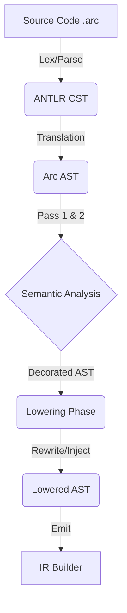

Based on the ANTLR4 generated code you provided, we have a robust Parser that produces a **Concrete Syntax Tree (CST)** (e.g., `FuncDeclContext`, `ExpressionContext`).

**Decision:** We **MUST** define our own custom AST structs and translate the ANTLR CST into this AST immediately after parsing.

**Why?**

1. **Mutability:** The ANTLR `*Context` objects are read-only views of the source text. You cannot easily "insert" a `decref` call or "wrap" a function body in an async state machine because those tokens don't exist in the source.
2. **Abstraction:** The ANTLR tree contains syntax noise (parentheses, commas, precedence hierarchy). Semantic analysis wants a flat, clean structure (e.g., `BinaryExpr{Op: "+", Left: A, Right: B}`).
3. **Type Safety:** ANTLR returns interfaces (`IExpressionContext`). A custom AST allows us to use concrete, type-safe Go structs.

updated `compiler_overview.md` reflecting the **CST → AST** architecture.

---

# Arc Compiler Architecture

## Data Flow Pipeline

The compiler uses a "Translation" strategy. We do not perform analysis directly on the ANTLR objects. Instead, we quickly convert them into a clean, mutable **Arc AST**.



---

## 1. Package `syntax` (Parsing & CST)

**Input:** `.arc` source bytes
**Output:** `*parser.CompilationUnitContext` (ANTLR CST)

This package strictly manages the grammar. It uses the ANTLR generated code you provided.

* **Lexer:** Handles tokenization and automatic semicolon insertion.
* **Parser:** Generates the raw parse tree.
* **Role:** This layer is purely mechanical. It does not know what a "Type" is; it only knows tokens.

---

## 2. Package `ast` (The Core Structure)

**Input:** None (Definitions only)
**Output:** Struct definitions

This package defines the **Canonical Arc AST**. These are the structs used by the entire rest of the compiler. Unlike the ANTLR context, these structs are simple, mutable, and free of syntax noise.

**Example Structure:**

```go
// ast/expr.go
type BinaryExpr struct {
    Op    token.Token // Operator (+, -, *)
    Left  Expr        // Recursive interface
    Right Expr
    Type  *Type       // Populated during Semantics
}

// ast/decl.go
type FuncDecl struct {
    Name       string
    IsAsync    bool
    IsGpu      bool
    Params     []*Field
    ReturnType Type
    Body       *BlockStmt
    // Metadata for LOWERING phase
    ClosureCtx *StructType // For async lowering
}

```

---

## 3. Package `frontend` (Translation & Semantics)

**Input:** ANTLR CST
**Output:** Typed Arc AST

This package bridges the gap between the parser and the logic.

### Phase A: CST to AST Translation

A visitor walks the ANTLR `ICompilationUnitContext` and builds the `ast` structs.

* *Optimization:* Operator precedence in ANTLR is nested (`AddExpr` inside `MulExpr`). The translator flattens this into `ast.BinaryExpr` based on the operator token.

### Phase B: Semantic Passes

Once we have the clean `ast`, we run our logic passes:

1. **Symbol Discovery:**
* Walk the `ast.File` and register all top-level names (`func`, `interface`, `enum`) into the Symbol Table.


2. **Type Inference:**
* Walk the function bodies.
* Assign types to `ast.BinaryExpr.Type`.
* Resolve identifiers to their definitions.
* **Generics:** If we see `swap[int32]`, we clone the AST sub-tree for `swap` and replace `T` with `int32` in the new copy.


---

## 4. Package `lower` (Transformation)

**Input:** Typed Arc AST
**Output:** Lowered Arc AST (Ready for IR)

This is where Arc's "Magic" happens. Because we own the AST structs, we can modify them dynamically.

* **ARC Injection:**
* Walks the AST. When it sees a block exit, it **injects** new `ast.CallExpr` nodes for `decref(var)` into the AST.
* It doesn't need to manipulate text; it just appends to `BlockStmt.List`.


* **Async State Machines:**
* Takes a `FuncDecl` marked `async`.
* Generates a **new** `StructDecl` (the context).
* Rewrites the function body to use the struct fields instead of local variables.
* This is impossible to do cleanly on ANTLR trees, but trivial on our custom AST.


---

## 5. Package `codegen` (IR Generation)

**Input:** Lowered Arc AST
**Output:** `ir_builder` calls

The final step is simple mapping.

* `ast.IfStmt` → `ir.CreateCondBr`
* `ast.BinaryExpr (+)` → `ir.CreateAdd`
* `ast.CallExpr` → `ir.CreateCall`

Since the `lower` package already handled the complex language features (async, defer, arc), the codegen package treats Arc almost like C.

---

## Summary of Packages

| Package | Responsibility | Key Data Structure |
| --- | --- | --- |
| **`syntax`** | Run ANTLR Lexer/Parser | `parser.CompilationUnitContext` |
| **`ast`** | Define language nodes | `ast.FuncDecl`, `ast.Expr` |
| **`frontend`** | Translate CST->AST, Type Check | `types.SymbolTable` |
| **`lower`** | Inject ARC, Lower Async/Defer | `ast.Node` (Mutated) |
| **`codegen`** | Emit IR | `ir_builder.Module` |